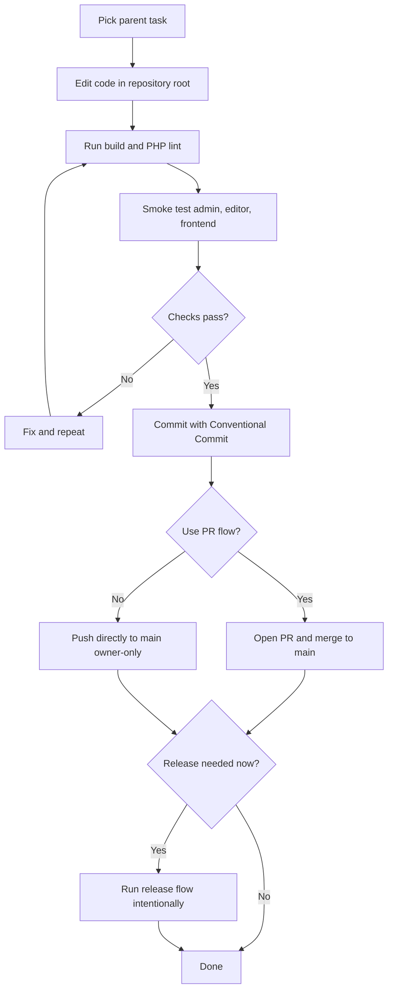

# Parent Developer Guide

This document covers practical workflow for the Lonestar parent theme repository root (`./`).

For child-theme-specific procedures, see:
- `docs/child-theme-guide.md`

## 1) Requirements

- WordPress 6.9+
- PHP 8.2+
- Node.js 20+
- npm 10+
- ACF Pro (required for ACF blocks and any module that registers ACF options/fields)

## 2) Scope

- Keep reusable framework logic in parent:
  - core bootstrap/runtime,
  - module catalog and module boot process,
  - shared blocks and asset pipeline.
- Keep project-specific behavior out of parent.

## 3) Initial Setup

From repository root:

```bash
npm install
npm run build
```

## 4) Daily Development Workflow

1. Edit parent code from repository root.
2. Use `npm run dev` for Vite development or `npm run build` for production output.
3. Run PHP lint on touched files.
4. Smoke test frontend, editor, and `Appearance -> Theme Settings` when relevant.

## 5) Command Reference

Run from repository root:

```bash
npm run dev
npm run build
npm run format
```

PHP lint:

```powershell
Get-ChildItem -Recurse -File -Filter *.php | ForEach-Object { php -l $_.FullName }
```

## 6) Versioning Practice

Recommended:
- keep `style.css` theme `Version` aligned with `package.json` `version`;
- use semver and increment intentionally;
- do not bump version in regular feature/fix PRs unless preparing a release.

## 7) Validation Checklist Before Main Update

1. `npm run build` passes.
2. PHP lint passes for touched files.
3. Manual smoke test passes:
   - frontend load
   - WP admin load
   - affected module/block behavior
   - desktop + mobile rendering

## 8) Deployment Checklist

1. Build artifacts generated (`npm run build`).
2. `dist/manifest.json` exists.
3. Deploy parent files including `dist/`.
4. Verify module settings and frontend rendering in target environment.

## 9) Common Pitfalls

- Mixing project-specific logic into parent framework code.
- Forgetting to include `dist/` artifacts in deployment.
- Shipping changes without smoke test of editor + frontend.
- Bumping version outside release flow.

## 10) Parent Development Flow (Mermaid)



Related:
- `docs/git-workflow.md`
- `docs/parent-release-updates.md`
