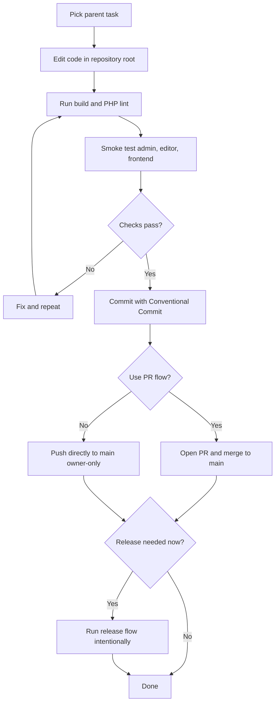

# Parent Developer Guide

This document covers practical workflow for the Lonestar parent theme repository root (`./`).

For child-theme-specific procedures, see:

- `docs/child-theme-guide.md`

## 1) Requirements

- WordPress 7.0+
- PHP 8.2+
- Node.js 22.12+
- npm 10+
- ACF Pro is optional and required only for ACF blocks/modules.

## 2) Scope

- Keep reusable framework logic in parent:
    - core bootstrap/runtime,
    - module catalog and module boot process,
    - shared blocks and asset pipeline.
    - declarative content-type discovery and registration from parent/child `inc/content-types/` roots.
- Keep project-specific behavior out of parent.

## 3) Initial Setup

From repository root:

```bash
npm ci
npm run build
```

## 4) Daily Development Workflow

1. Edit parent code from repository root.
2. Use `npm run dev` for Vite development or `npm run build` for production output.
3. Run PHP lint on touched files.
4. Smoke test frontend, editor, and `Appearance -> Theme Settings` when relevant.

## 5) Command Reference

Run from repository root:

```bash
npm run dev
npm run build
npm run browsers
npm run format
npm run check
php tests/content-types-runtime.php
```

`npm run browsers` prints the browser matrix inherited from the official WordPress Browserslist profile.

## 5.1) CSS Pipeline

Vite loads `postcss.config.js` automatically. The pipeline order is:

1. `postcss-nesting` flattens standards-based nested selectors.
2. Autoprefixer adds prefixes for the resolved WordPress Browserslist targets.
3. Vite bundles and minifies the result.

`postcss` is required as the plugin runner. `browserslist` and `@wordpress/browserslist-config` make the compatibility policy explicit and reusable. Vite already resolves local CSS `@import`, so there is no separate import plugin. Tailwind and Sass-like `postcss-nested` syntax are not supported.

The Browserslist policy is consumed by Autoprefixer; it does not silently replace Vite's JavaScript `build.target`. Treat JavaScript compatibility as a separate, explicit architecture decision.

PHP lint:

```powershell
Get-ChildItem -Recurse -File -Filter *.php | ForEach-Object { php -l $_.FullName }
```

## 5.2) Vite Dev-Mode Detection & Runtime Caching

`lonestar_is_vite_dev_mode()` (`inc/core/blocks-acf-enqueue.php`) resolves dev mode in this order:

1. `LONESTAR_VITE_DEVELOPMENT` constant, if defined — explicit override, always wins.
2. Legacy `IS_VITE_DEVELOPMENT` constant, if defined and `LONESTAR_VITE_DEVELOPMENT` is not — explicit override.
3. `LONESTAR_VITE_DEV` environment variable (`1`/`true`/`yes`/`on`), if set — explicit override.
4. If `wp_get_environment_type()` is `production`, dev mode is always `false`.
5. Otherwise, an automatic HTTP probe against `LONESTAR_VITE_SERVER` (`GET {LONESTAR_VITE_SERVER}/@vite/client`, cached per-namespace transient for one minute) — but only when `wp_get_environment_type()` is `local` or `development`. Other environment types (e.g. `staging`) never auto-probe; use `LONESTAR_VITE_DEVELOPMENT` (or legacy `IS_VITE_DEVELOPMENT`) or `LONESTAR_VITE_DEV` there instead.

Filter `lonestar_vite_dev_probe_enabled( bool $probe_enabled, string $probe_environment )` can override step 4's environment gate (e.g. to allow the probe on a custom environment type). It only affects the automatic probe; it does not run when an explicit constant/env var already decided the result.

Block discovery (ACF/native/PHP-only registration + the Vite asset map) is cached behind a single consolidated "block runtime index" (`lonestar_get_block_runtime_index()`, transient key `lonestar_block_runtime_v1`), request-memoized and namespace-checked so a deploy/build automatically invalidates it without leaving orphaned transients under old keys. Dev mode always bypasses the transient (fresh discovery per request) but is still request-memoized. Call `lonestar_flush_block_discovery_caches()` to force a rebuild (also runs automatically on theme switch / plugin-upgrader completion).

## 6) Versioning Practice

Recommended:

- keep `style.css` theme `Version` aligned with `package.json` `version`;
- use semver and increment intentionally;
- do not bump version in regular feature/fix PRs unless preparing a release.

## 7) Validation Checklist Before Main Update

1. `npm run check` passes and the rebuilt `dist/` matches tracked output.
2. PHP lint passes for touched files.
3. Manual smoke test passes:
    - frontend load
    - WP admin load
    - affected module/block behavior
    - desktop + mobile rendering

## 8) Deployment Checklist

1. Build artifacts generated (`npm run build`).
2. `dist/manifest.json` exists.
3. Deploy parent files including `dist/`.
4. Verify module settings and frontend rendering in target environment.

## 9) Common Pitfalls

- Mixing project-specific logic into parent framework code.
- Forgetting to include `dist/` artifacts in deployment.
- Shipping changes without smoke test of editor + frontend.
- Bumping version outside release flow.
- Putting a PHP-only block under `blocks/native/` instead of `blocks/php-only/`.
- Editing child `functions.php` just to register a content type; use `inc/content-types/*.php` and the validated return contract in `docs/content-types.md`.
- Using Sass-like nesting, Tailwind utilities, or an implicit browser target outside the documented CSS pipeline.

The complete block selection and filesystem contract is in `docs/block-types.md`.
The content-type discovery, validation, and rewrite contract is in `docs/content-types.md`.

## 10) Parent Development Flow (Mermaid)


```mermaid
flowchart TD
    A[Pick parent task] --> B[Edit code in repository root]
    B --> C[Run build and PHP lint]
    C --> D[Smoke test admin, editor, frontend]
    D --> E{Checks pass?}
    E -->|No| F[Fix and repeat]
    F --> C
    E -->|Yes| G[Commit with Conventional Commit]
    G --> H{Use PR flow?}
    H -->|Yes| I[Open PR and merge to main]
    H -->|No| J[Push directly to main owner-only]
    I --> K{Release needed now?}
    J --> K
    K -->|No| L[Done]
    K -->|Yes| M[Run release flow intentionally]
    M --> L
```

Related:

- `docs/git-workflow.md`
- `docs/parent-release-updates.md`

## 11) Deprecated compatibility aliases

New public PHP symbols use the `lonestar_`/`LONESTAR_` prefix (see the parent theme's `AGENTS.md`). Older unprefixed names are kept as compatibility aliases and are safe to keep using, but new code should prefer the `LONESTAR_`/`lonestar_` name on the left below.

Vite/build constants (`inc/core/vite.php`). Resolution: if the `LONESTAR_*` constant is explicitly defined (e.g. in `wp-config.php` or a child theme) it wins; else the legacy constant's value is honored if defined; else the built-in default applies. Both names are always defined after `vite.php` loads.

| Current                      | Deprecated alias    | Default                                        |
| ---------------------------- | ------------------- | ---------------------------------------------- |
| `LONESTAR_DIST_DEF`          | `DIST_DEF`          | `dist` (derived from `LONESTAR_DIST_REL_PATH`) |
| `LONESTAR_DIST_URI`          | `DIST_URI`          | `{theme uri}/dist`                             |
| `LONESTAR_DIST_PATH`         | `DIST_PATH`         | `{theme path}/dist`                            |
| `LONESTAR_JS_DEPENDENCY`     | `JS_DEPENDENCY`     | `array()`                                      |
| `LONESTAR_JS_LOAD_IN_FOOTER` | `JS_LOAD_IN_FOOTER` | `true`                                         |
| `LONESTAR_VITE_SERVER`       | `VITE_SERVER`       | `http://localhost:3000`                        |
| `LONESTAR_VITE_ENTRY_POINT`  | `VITE_ENTRY_POINT`  | `/main.js`                                     |

`LONESTAR_TEMPLATE_PATH`, `LONESTAR_TEMPLATE_URI`, `LONESTAR_ACF_BLOCKS_PATH`, `LONESTAR_NATIVE_BLOCKS_PATH`, `LONESTAR_PHP_ONLY_BLOCKS_PATH`, and `LONESTAR_DIST_REL_PATH` (defined in `functions.php`) keep their unprefixed `TEMPLATE_PATH` / `TEMPLATE_URI` / `ACF_BLOCKS_PATH` / `NATIVE_BLOCKS_PATH` / `PHP_ONLY_BLOCKS_PATH` / `DIST_REL_PATH` aliases the same way.

The Vite dev-mode opt-in flag is the one exception to the "both names always defined" rule above: `LONESTAR_VITE_DEVELOPMENT` is checked ahead of the legacy `IS_VITE_DEVELOPMENT`, but neither is auto-defined — define whichever one you use, in `wp-config.php` or a child theme, and leave the other unset.

Script/style enqueue handles (`inc/core/vite.php`, `lonestar_enqueue_vite_assets()`): the production entry script handle is `lonestar-main` (was the unprefixed `main`), and built CSS handles are `lonestar-{filename}` (was the bare `{filename}`, e.g. `main`). If nothing else has already registered the old bare handle, it is re-registered as a dependency-only alias (`wp_register_script( 'main', false, array( 'lonestar-main' ) )` / the style equivalent) so a child theme or plugin that lists `'main'` as a script/style dependency keeps working unchanged.

Helper functions:

| Current                         | Deprecated alias             | File                                    |
| ------------------------------- | ---------------------------- | --------------------------------------- |
| `lonestar_write_log()`          | `write_log()`                | `inc/helpers/helper.debug.php`          |
| `lonestar_printr()`             | `printr()`                   | `inc/helpers/helper.printr.php`         |
| `lonestar_shortcode_reserved()` | `theme_shortcode_reserved()` | `inc/shortcodes/shortcode.reserved.php` |
| `lonestar_shortcode_year()`     | `theme_shortcode_year()`     | `inc/shortcodes/shortcode.year.php`     |

These aliases are plain wrapper functions guarded by `function_exists()`; no `_deprecated_function()` notice is emitted (avoids log noise for frequently-called debug/shortcode helpers). The `[R]`, `[Y]`, and `[year]` shortcode tags themselves are unchanged — only the PHP callback names moved.

Legacy `modules_*` namespace: the ~80-function `modules_*` family in `inc/core/modules*.php` (module/block catalog, admin screen, toggles) predates the prefix convention and is **not** renamed in this phase — it is too large a surface for one pass. It is scheduled to move to `lonestar_module_*` at the 1.0 release, with `modules_*` kept as compatibility aliases at that time. See the file-level docblock in `inc/core/modules.php`.

Other deprecated/legacy items:

- `modules_get_module_php_files_for_scanning()` (`inc/core/modules_catalog.php`) is no longer called internally (its only caller was unreachable dead code removed from `modules_get_module_admin_links()`). It remains public for backward compatibility but is deprecated; prefer reading `module.json`/block-sidecar JSON `admin_links` metadata directly instead of scanning PHP files for ACF options-page calls.
- `lonestar_asset_url_to_path()` (`inc/core/blocks-acf-enqueue.php`) is kept only for backward compatibility; internal code uses `lonestar_theme_asset_url_to_path()`.
- `lonestar_get_block_discovery_transient_key()`, `lonestar_get_cached_block_directories()`, and `lonestar_get_cached_block_asset_registration_map()` are kept as backward-compatible delegates to the consolidated block runtime index (`lonestar_get_block_runtime_index()`); prefer the runtime index directly in new code.
