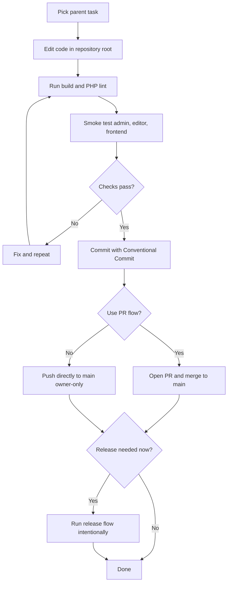

# Parent Developer Guide

This document covers practical workflow for the Lonestar parent theme repository root (`./`).

For child-theme-specific procedures, see:

- `docs/child-theme-guide.md`

## 1) Requirements

- WordPress 7.0+
- PHP 8.2+
- Node.js 22.12+
- npm 10+
- ACF Pro is optional and required only for ACF blocks/modules.
- Composer 2 is optional, required only to run the PHP quality tooling (`phpcs`, `phpstan`).

## 2) Scope

- Keep reusable framework logic in parent:
    - core bootstrap/runtime,
    - module catalog and module boot process,
    - shared blocks and asset pipeline.
    - declarative content-type discovery and registration from parent/child `inc/content-types/` roots.
- Keep project-specific behavior out of parent.

## 3) Initial Setup

From repository root:

```bash
npm ci
npm run build
```

## 4) Daily Development Workflow

1. Edit parent code from repository root.
2. Use `npm run dev` for Vite development or `npm run build` for production output.
3. Run PHP lint on touched files.
4. Smoke test frontend, editor, and `Appearance -> Theme Settings` when relevant.

## 5) Command Reference

Run from repository root:

```bash
npm run dev
npm run build
npm run browsers
npm run format
npm run check
php tests/content-types-runtime.php
```

`npm run browsers` prints the browser matrix inherited from the official WordPress Browserslist profile.

### 5a) PHP quality gates (optional, requires Composer)

```bash
composer install
composer run lint:phpcs
composer run lint:phpstan
```

- `phpcs` uses `phpcs.xml.dist`, a curated WordPress Coding Standards ruleset scoped to security (escaping/nonces/sanitization), i18n, discouraged/deprecated functions, and PHP 8.2+ compatibility (`PHPCompatibilityWP`, `testVersion 8.2-`). It deliberately excludes formatting/whitespace sniffs that conflict with this codebase's 4-space indentation and `array()` long syntax, and excludes `PrefixAllGlobals` for files that define documented legacy compatibility symbols (`TEMPLATE_PATH`, `modules_*()`, etc. — see the root `AGENTS.md`).
- `phpstan` runs at level 5 over `functions.php`, `inc/`, `modules/`, and `blocks/`, using `szepeviktor/phpstan-wordpress` for WordPress core stubs and `php-stubs/acf-pro-stubs` for ACF. `phpstan-baseline.neon` captures pre-existing findings so the gate passes clean; do not add new findings to the baseline without a reason.
- None of this tooling (`composer.json`, `composer.lock`, `phpcs.xml.dist`, `phpstan*.neon*`, `vendor/`) ships in release ZIPs.

## 5.1) CSS Pipeline

Vite loads `postcss.config.js` automatically. The pipeline order is:

1. `postcss-nesting` flattens standards-based nested selectors.
2. Autoprefixer adds prefixes for the resolved WordPress Browserslist targets.
3. Vite bundles and minifies the result.

`postcss` is required as the plugin runner. `browserslist` and `@wordpress/browserslist-config` make the compatibility policy explicit and reusable. Vite already resolves local CSS `@import`, so there is no separate import plugin. Tailwind and Sass-like `postcss-nested` syntax are not supported.

The Browserslist policy is consumed by Autoprefixer; it does not silently replace Vite's JavaScript `build.target`. Treat JavaScript compatibility as a separate, explicit architecture decision.

PHP lint:

```powershell
Get-ChildItem -Recurse -File -Filter *.php | ForEach-Object { php -l $_.FullName }
```

## 5.2) Vite Dev-Mode Detection & Runtime Caching

`lonestar_is_vite_dev_mode()` (`inc/core/blocks-acf-enqueue.php`) resolves dev mode in this order:

1. `LONESTAR_VITE_DEVELOPMENT` constant, if defined — explicit override, always wins.
2. `LONESTAR_VITE_DEV` environment variable (`1`/`true`/`yes`/`on`), if set — explicit override.
3. If `wp_get_environment_type()` is `production`, dev mode is always `false`.
4. Otherwise, an automatic HTTP probe against `LONESTAR_VITE_SERVER` (`GET {LONESTAR_VITE_SERVER}/@vite/client`, cached per-namespace transient for one minute) — but only when `wp_get_environment_type()` is `local` or `development`. Other environment types (e.g. `staging`) never auto-probe; use `LONESTAR_VITE_DEVELOPMENT` or `LONESTAR_VITE_DEV` there instead.

Filter `lonestar_vite_dev_probe_enabled( bool $probe_enabled, string $probe_environment )` can override step 4's environment gate (e.g. to allow the probe on a custom environment type). It only affects the automatic probe; it does not run when an explicit constant/env var already decided the result.

Block discovery (ACF/native/PHP-only registration + the Vite asset map) is cached behind a single consolidated "block runtime index" (`lonestar_get_block_runtime_index()`, transient key `lonestar_block_runtime_v1`), request-memoized and namespace-checked so a deploy/build automatically invalidates the payload under the fixed key. Dev mode always bypasses the transient (fresh discovery per request) but is still request-memoized. Call `lonestar_flush_block_discovery_caches()` to force a rebuild (also runs automatically on theme switch / plugin-upgrader completion).

## 6) Versioning Practice

Recommended:

- keep `style.css` theme `Version` aligned with `package.json` `version`;
- use semver and increment intentionally;
- do not bump version in regular feature/fix PRs unless preparing a release.

## 7) Validation Checklist Before Main Update

1. `npm run check` passes and the rebuilt `dist/` matches tracked output.
2. PHP lint passes for touched files.
3. Manual smoke test passes:
    - frontend load
    - WP admin load
    - affected module/block behavior
    - desktop + mobile rendering

## 8) Deployment Checklist

1. Build artifacts generated (`npm run build`).
2. `dist/manifest.json` exists.
3. Deploy parent files including `dist/`.
4. Verify module settings and frontend rendering in target environment.

## 9) Common Pitfalls

- Mixing project-specific logic into parent framework code.
- Forgetting to include `dist/` artifacts in deployment.
- Shipping changes without smoke test of editor + frontend.
- Bumping version outside release flow.
- Putting a PHP-only block under `blocks/native/` instead of `blocks/php-only/`.
- Editing child `functions.php` just to register a content type; use `inc/content-types/*.php` and the validated return contract in `docs/content-types.md`.
- Using Sass-like nesting, Tailwind utilities, or an implicit browser target outside the documented CSS pipeline.

The complete block selection and filesystem contract is in `docs/block-types.md`.
The content-type discovery, validation, and rewrite contract is in `docs/content-types.md`.

## 10) Parent Development Flow (Mermaid)


```mermaid
flowchart TD
    A[Pick parent task] --> B[Edit code in repository root]
    B --> C[Run build and PHP lint]
    C --> D[Smoke test admin, editor, frontend]
    D --> E{Checks pass?}
    E -->|No| F[Fix and repeat]
    F --> C
    E -->|Yes| G[Commit with Conventional Commit]
    G --> H{Use PR flow?}
    H -->|Yes| I[Open PR and merge to main]
    H -->|No| J[Push directly to main owner-only]
    I --> K{Release needed now?}
    J --> K
    K -->|No| L[Done]
    K -->|Yes| M[Run release flow intentionally]
    M --> L
```

Related:

- `docs/git-workflow.md`
- `docs/parent-release-updates.md`
