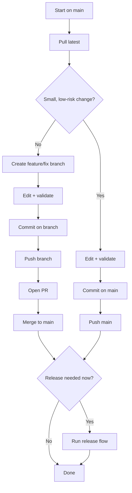

# Parent Theme Git Workflow

This workflow is optimized for maintaining the `lonestar` parent theme as a solo developer, with optional PR usage.

## Workflow Diagram



## 1) Branch Strategy

- Default branch: `main`
- Recommended for larger changes: `feat/<short-slug>` or `fix/<short-slug>`
- Recommended in team/collaboration mode: always use PR flow
- Direct commit to `main`: owner-only shortcut for small low-risk fixes

## 2) Commit Rules

Use Conventional Commits:

- `feat: ...`
- `fix: ...`
- `chore: ...`
- `refactor: ...`

Examples:

- `feat: add blocks tab in theme settings`
- `fix: improve module override indicator in admin`

## 3) Daily Solo Flow (Direct Main)

```bash
git checkout main
git pull
# edit files
git add -A
git commit -m "fix: concise change summary"
git push origin main
```

Use this for quick, low-risk updates.

If branch protection requires PRs, this path is not available and PR flow is mandatory.

## 4) Optional PR Flow

```bash
git checkout main
git pull
git checkout -b feat/short-topic
# edit files
git add -A
git commit -m "feat: concise change summary"
git push -u origin feat/short-topic
```

Then open PR and merge into `main`.

Use this for bigger refactors, risky changes, or when review is needed.

## 5) Validation Before Push/Merge

From repository root:

```bash
npm run build
```

PHP lint:

```powershell
Get-ChildItem -Recurse -File -Filter *.php | ForEach-Object { php -l $_.FullName }
```

Also run manual smoke test in admin + frontend.

## 6) Release Relation (Parent Theme)

- Parent releases are cut from `main` through an intentional release trigger/tag.
- Commits should stay conventional so semantic versioning can be derived reliably.
- For release details see:
  - `docs/parent-release-updates.md`
