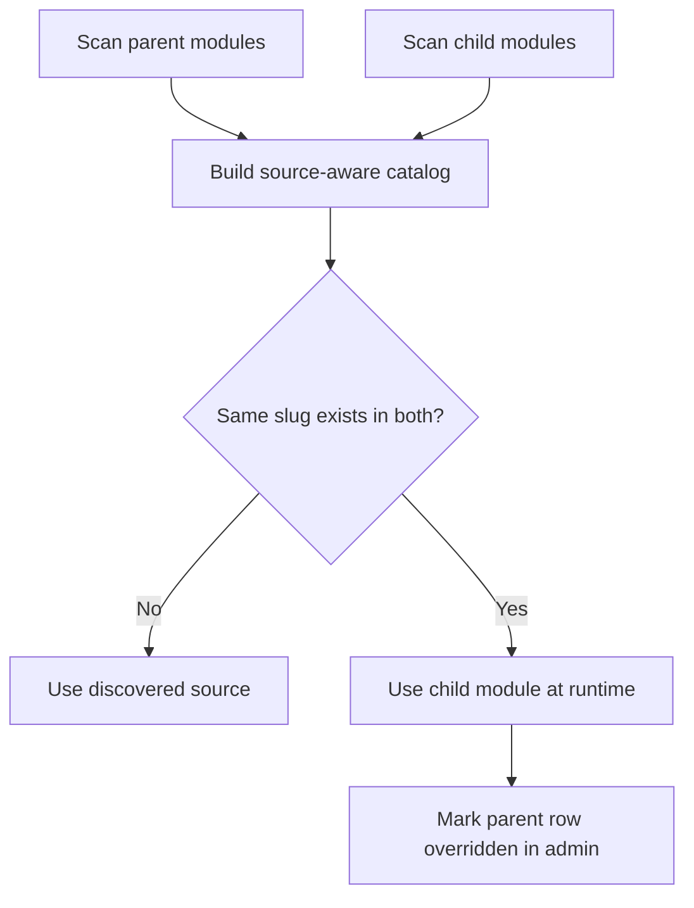
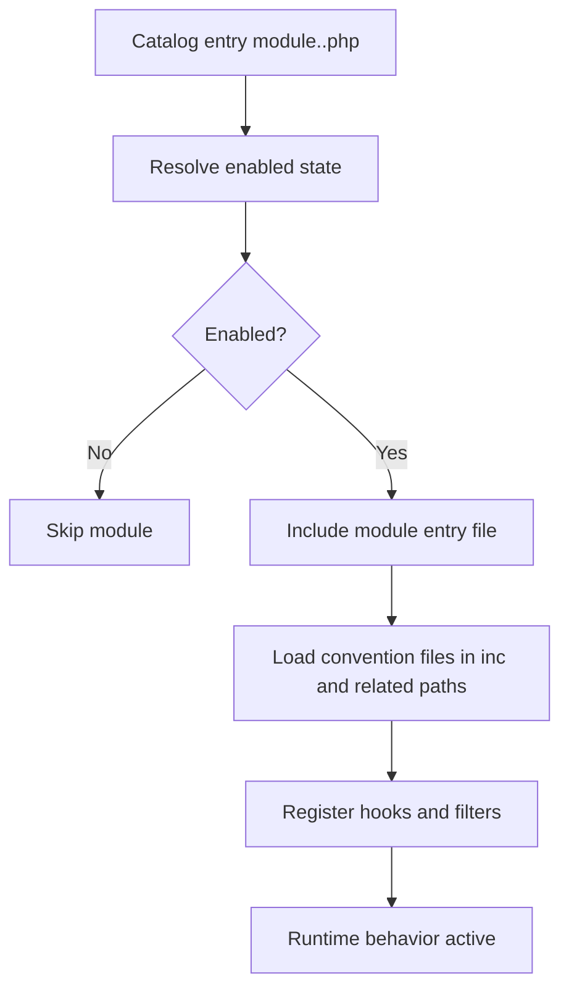

# Modules Anatomy

This document explains how Lonestar modules are structured and executed in parent + child theme setups.

## 1) Where Module Discovery Happens

Module catalog and bootstrap are implemented in parent core:
- `inc/core/modules.php`
- `inc/core/modules_catalog.php`
- `inc/core/modules_state.php`
- `inc/core/modules_bootstrap.php`

Important default:
- module sources are discovered from:
  - parent: `get_template_directory() . '/modules'`
  - child (when active): `get_stylesheet_directory() . '/modules'`
- catalog keys are source-aware (`template__<slug>`, `stylesheet__<slug>`).
- if the same slug is enabled in both sources, child-source module wins at runtime.
- in Theme Settings, overridden parent-module rows are shown as disabled with an override note.

### Discovery and Override Priority (Mermaid)



## 2) Module Types

### Flat module

File format:

```text
modules/module.<slug>.php
```

Best for very small, single-file features.

### Folder module

Directory format:

```text
modules/<slug>/
|-- module.<slug>.php
|-- inc/
|-- assets/
|-- blocks/acf/
|-- blocks/native/
`-- acf-json/
```

Best for medium and large features.

## 3) Folder Module Load Anatomy

Typical flow for an enabled folder module:

1. Catalog discovers module entry file `module.<slug>.php`.
2. Module toggle state is resolved from option `lonestar_module_toggles` (source-aware keys).
3. `modules_boot_theme_modules()` boots enabled modules.
4. `modules_boot_single_module()` includes entry file and support convention files.
5. Module hooks/actions/filters become active at runtime.

### Module Boot Flow (Mermaid)



Parent module state also supports:
- forced disable constants:
  - `MODULES_DISABLE_ALL`
  - `MODULES_DISABLED`
  - `LONESTAR_DISABLE_ALL_MODULES`
  - `LONESTAR_DISABLED_MODULES`
- sentinel file: `.disable-modules`
- module catalog cache key now fingerprints parent/child `modules/` roots, so module add/remove changes refresh discovery automatically.

## 4) Convention Paths Used By Module Runtime

Depending on module shape and code, common module internals include:
- `inc/inc.*.php`
- `inc/helpers/*.php`
- `inc/shortcodes/*.php`
- `inc/walkers/*.php`
- `assets/*`
- `blocks/acf/*`
- `blocks/native/*`
- `acf-json/*`

For block-related assets:
- enabled module block roots are merged into the block asset/discovery pipeline.

## 5) GTM Module Anatomy (Example)

Example module structure:

```text
modules/gtm/
|-- module.gtm.php
|-- module.json
`-- inc/
    |-- inc.main.php
    |-- inc.settings.php
    `-- inc.gtm-script.php
```

Responsibility split:
- `module.gtm.php`  
  Bootstrap: requires `inc/inc.*.php`.
- `module.json`  
  Provides module metadata and Settings link (`Theme Settings -> GTM` tab).
- `inc.main.php`  
  Hooks output into `wp_head` and `wp_body_open`.
- `inc.settings.php`  
  Registers native GTM settings tab in Theme Settings and stores values in `lonestar_gtm_settings` option.
- `inc.gtm-script.php`  
  Normalizes GTM ID and renders script/noscript markup.

## 6) Using Modules In Child Theme

Child modules are auto-discovered when a child theme is active.

Practical recommendation:
- keep reusable modules in parent `modules/`,
- keep project-specific modules in child `modules/`,
- avoid duplicate slug/function naming across parent+child module implementations unless intentionally overriding behavior.

## 7) Creating a New Module (Recommended Process)

1. Pick module type (flat vs folder).
2. Create `module.<slug>.php` with metadata docblock.
3. Add logic in `inc/` files and register hooks.
4. If needed, add ACF options/fields and `acf-json`.
5. If needed, add `blocks/acf` or `blocks/native` assets.
6. Enable via `Appearance -> Theme Settings`.
7. Validate frontend/admin and build artifacts.

## 8) Troubleshooting

- Module does not appear in admin list:
  - verify filename pattern `module.<slug>.php`,
  - verify module is under `modules/` of parent or active child theme.
- Module appears but has no effect:
  - verify toggle is enabled,
  - if same slug exists in both sources, verify which source is enabled and expected to win,
  - verify hooks fire on expected action timing.
- GTM settings tab missing:
  - verify GTM module is enabled in `Appearance -> Theme Settings -> Modules`,
  - verify no fatal errors in GTM module files.
