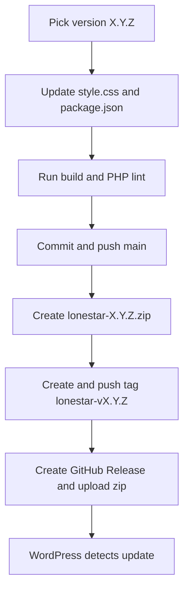
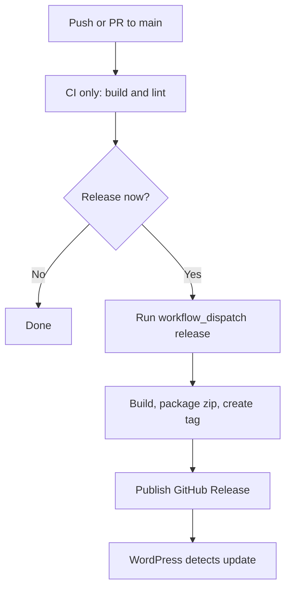

# Parent Theme Release Procedure

This runbook defines release behavior for this repository (Lonestar parent theme).

## Release Modes

- Current mode: manual release (implemented now).
- Target mode: automated release pipeline (recommended when workflows are added).
- Normal `git push` is never a release by itself.

WordPress update availability depends on published GitHub Releases consumed by:
- `inc/core/theme-updates.php`

## Naming Contract

- Tag format: `lonestar-vX.Y.Z`
- Asset format: `lonestar-X.Y.Z.zip`
- Zip root folder: `lonestar/`

## Current Mode Diagram (Manual)

## Current Mode Steps (Manual)

1. Choose version `X.Y.Z` (example `0.2.1`).
2. Sync version in:
   - `style.css` (`Version`)
   - `package.json` (`version`)
3. Update `CHANGELOG.md` under `## [Unreleased]`.
4. Validate from repository root:
   - `npm ci`
   - `npm run build`
   - `Get-ChildItem -Recurse -File -Filter *.php | ForEach-Object { php -l $_.FullName }`
5. Commit and push:
   - `git checkout main`
   - `git pull`
   - `git add -A`
   - `git commit -m "chore(release): lonestar vX.Y.Z"`
   - `git push origin main`
6. Build zip asset: `lonestar-X.Y.Z.zip` (root folder inside zip must be `lonestar/`).
7. Create and push tag:
   - `git tag -a lonestar-vX.Y.Z -m "Lonestar vX.Y.Z"`
   - `git push origin lonestar-vX.Y.Z`
8. Publish GitHub Release from that tag and upload zip asset.
9. Verify in `Dashboard -> Updates` that update appears when remote version is higher.

## Target Mode Diagram (Automated Pipeline)

## Target Mode Blueprint (Not Yet Implemented)

Recommended trigger strategy:
- `main` pushes: CI checks only (no release).
- Release: `workflow_dispatch` (intentional trigger).
- Optional alternative: tag-push trigger `lonestar-v*.*.*`.

Recommended workflow responsibilities:
1. Validate clean state and run build/lint.
2. Resolve release version (input or semantic bump).
3. Build package `lonestar-X.Y.Z.zip`.
4. Create tag `lonestar-vX.Y.Z`.
5. Publish GitHub Release and attach zip.

## Token Note

- Public repository release checks usually do not require a personal token.
- If GitHub API rate limits become an issue, define `LONESTAR_GITHUB_TOKEN` in WordPress runtime.
