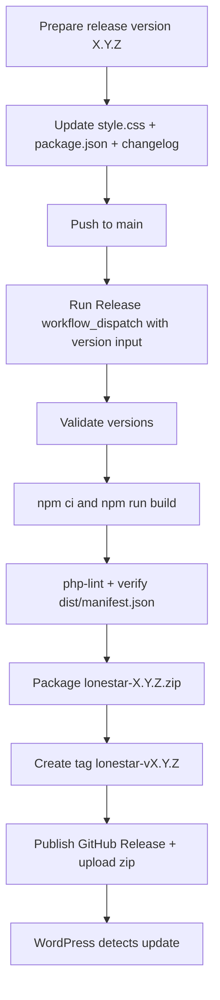

# Parent Theme Release Procedure

This runbook defines release behavior for this repository (Lonestar parent theme).

## Release Modes

- Current mode: automated release pipeline via `workflow_dispatch` (implemented now).
- Manual release is fallback-only (emergency path).
- Normal `git push` is never a release by itself.

WordPress update availability depends on published GitHub Releases consumed by:
- `inc/core/theme-updates.php`

## Naming Contract

- Tag format: `lonestar-vX.Y.Z`
- Asset format: `lonestar-X.Y.Z.zip`
- Zip root folder: `lonestar/`

## CI and Release Triggers

- CI workflow: `.github/workflows/ci.yml`
  - Trigger: `push` and `pull_request` to `main`
  - Jobs: `build`, `php-lint`
- Release workflow: `.github/workflows/release.yml`
  - Trigger: `workflow_dispatch` (manual start from GitHub Actions UI)
  - Required input: `version` (`X.Y.Z`)

## Current Mode Diagram (workflow_dispatch)

## Operator Steps (What You Do)

1. Pick release version `X.Y.Z` (example: `0.2.1`).
2. Sync version fields:
   - `style.css` -> `Version`
   - `package.json` -> `version`
3. Update `CHANGELOG.md` under `## [Unreleased]`.
4. Commit and push changes to `main`.
5. Open GitHub `Actions -> Release -> Run workflow`.
6. Enter `version` (`X.Y.Z`) and run from `main`.

## Workflow Steps (What Pipeline Does)

1. Verifies branch is `main`.
2. Verifies version input format and file-version alignment.
3. Runs `npm ci` and `npm run build`.
4. Runs PHP lint on all `.php` files.
5. Verifies `dist/manifest.json` exists.
6. Packages `lonestar-X.Y.Z.zip` with root folder `lonestar/`.
7. Creates and pushes tag `lonestar-vX.Y.Z`.
8. Publishes GitHub Release and attaches zip asset.

## Manual Fallback (If Actions Is Unavailable)

Use the manual sequence only as fallback:
1. Build and lint locally.
2. Package `lonestar-X.Y.Z.zip`.
3. Create/push `lonestar-vX.Y.Z` tag.
4. Create GitHub Release and upload zip.

## Token Note

- Public repository release checks usually do not require a personal token.
- If GitHub API rate limits become an issue, define `LONESTAR_GITHUB_TOKEN` in WordPress runtime.
